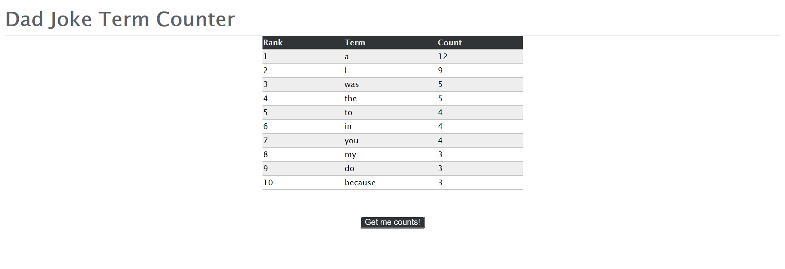
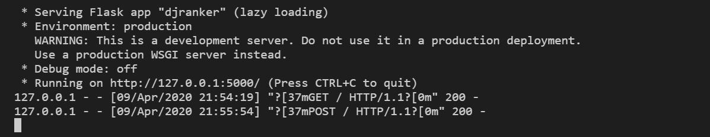

# DJranker

DJranker is an applications that displays the 10 most common terms in a corpus of jokes. The jokes are randomly fetched using the [icanhazdadjoke](https://icanhazdadjoke.com/api) API, and the user gets to select the number of random jokes to be fetched with a minimum of 10 jokes

## Installation

```git clone```

```pip install flask```

```pip install requests```

```pip install pandas```


## Usage

To run the application enter in the command line

```python run.py```

This should locally host the web application and prompt the user to enter the home address as shown below


The user can then select the number of random jokes that will be fetched which has a minimum requirement of 10. By clicking the **Get me counts!** button the application will display the 10 most common terms found from the jokes fetched as shown below



In the terminal one would see the API requests made to the application

